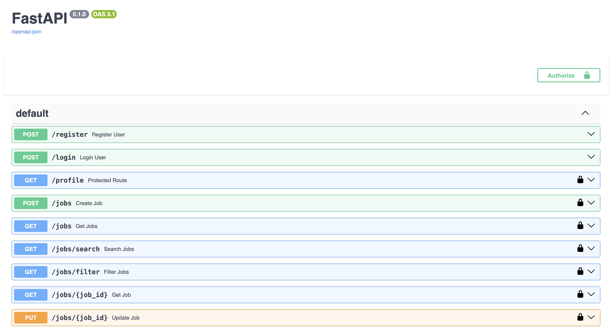
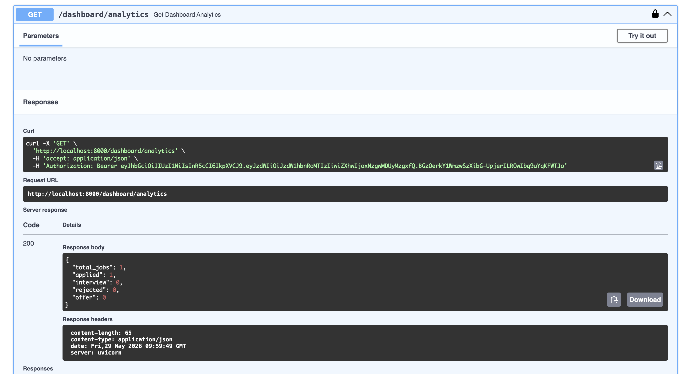
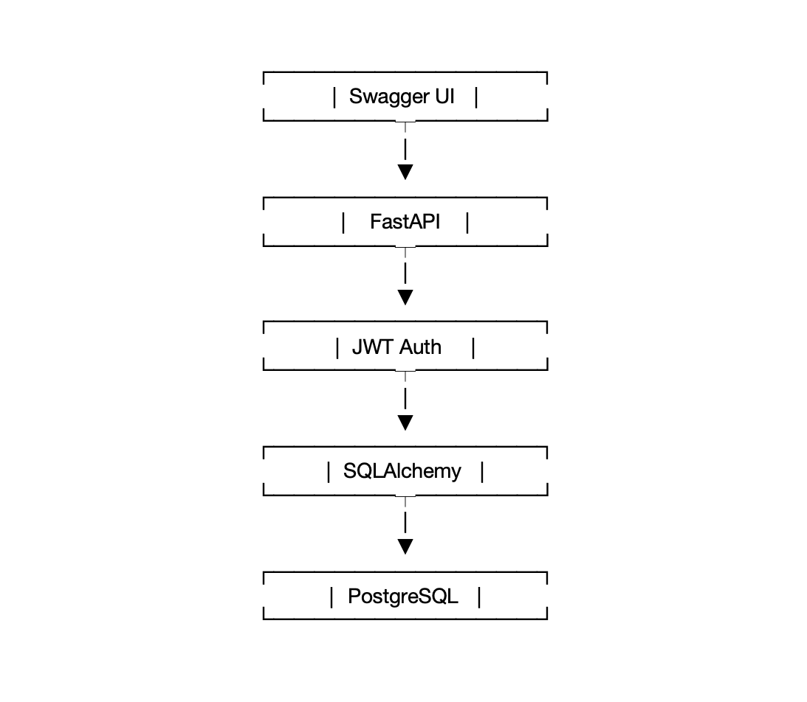

#  Job Tracker Platform

A secure and scalable Job Application Tracking Platform built with **FastAPI**, **PostgreSQL**, **SQLAlchemy**, **JWT Authentication**, and **Docker**. This application helps users manage job applications, track application statuses, and analyze their job search progress through dashboard analytics.

---

##  Features

###  Authentication & Security

* User Registration
* User Login
* JWT Authentication
* Protected Routes
* User-specific Data Access

###  Job Management

* Create Job Applications
* View All Applications
* View Single Application
* Update Applications
* Delete Applications

###  Advanced Search & Filtering

* Search Jobs by Company
* Filter Jobs by Status
* Pagination Support

###  Analytics Dashboard

* Total Applications Count
* Applied Jobs Count
* Interview Count
* Rejected Count
* Offer Count

###  Deployment Ready

* PostgreSQL Database
* Docker Containerization
* Interactive Swagger API Documentation

---

##  Tech Stack

| Technology | Purpose              |
| ---------- | -------------------- |
| Python     | Programming Language |
| FastAPI    | Backend Framework    |
| PostgreSQL | Database             |
| SQLAlchemy | ORM                  |
| Pydantic   | Data Validation      |
| JWT        | Authentication       |
| Docker     | Containerization     |
| Uvicorn    | ASGI Server          |

---

## 📸 Project Screenshots

### Swagger API Documentation



### Dashboard Analytics



### System Architecture



---

##  Sample Dashboard Analytics Response

```json
{
  "total_jobs": 25,
  "applied": 15,
  "interview": 5,
  "rejected": 3,
  "offer": 2
}
```

---

## 🔗 API Endpoints

### Authentication

| Method | Endpoint  | Description      |
| ------ | --------- | ---------------- |
| POST   | /register | Register User    |
| POST   | /login    | Login User       |
| GET    | /profile  | Get User Profile |

### Jobs

| Method | Endpoint       | Description            |
| ------ | -------------- | ---------------------- |
| POST   | /jobs          | Create Job             |
| GET    | /jobs          | Get All Jobs           |
| GET    | /jobs/{job_id} | Get Single Job         |
| PUT    | /jobs/{job_id} | Update Job             |
| DELETE | /jobs/{job_id} | Delete Job             |
| GET    | /jobs/search   | Search Jobs by Company |
| GET    | /jobs/filter   | Filter Jobs by Status  |

### Dashboard

| Method | Endpoint             | Description         |
| ------ | -------------------- | ------------------- |
| GET    | /dashboard/analytics | Dashboard Analytics |

---

##  Project Structure

```text
backend/
│
├── app/
│   ├── auth/
│   │   └── dependencies.py
│   │
│   ├── config/
│   │
│   ├── database/
│   │   └── database.py
│   │
│   ├── models/
│   │   ├── user.py
│   │   └── job.py
│   │
│   ├── routes/
│   │   ├── user_routes.py
│   │   └── job_routes.py
│   │
│   ├── schemas/
│   │   ├── user_schema.py
│   │   └── job_schema.py
│   │
│   └── main.py
│
├── Dockerfile
├── requirements.txt
├── .gitignore
└── README.md
```

---

## Installation

### Clone Repository

```bash
git clone https://github.com/sumanthnandipati/job-tracker-platform.git
cd job-tracker-platform/backend
```

### Create Virtual Environment

```bash
python -m venv venv
source venv/bin/activate
```

### Install Dependencies

```bash
pip install -r requirements.txt
```

### Run Application

```bash
uvicorn app.main:app --reload
```

Open:

```text
http://127.0.0.1:8000/docs
```

---

## 🐳 Docker Setup

Build Docker Image:

```bash
docker build -t job-tracker .
```

Run Container:

```bash
docker run -p 8000:8000 job-tracker
```

---

##  Future Enhancements

* Resume Upload Feature
* Email Notifications
* Interview Scheduling
* Job Application Reminders
* React Frontend Dashboard
* AWS Deployment (EC2 + RDS)
* CI/CD Pipeline using GitHub Actions

---

##  Author

**Sumanth Nandipati**

Master's in Computer Science | Backend & Data Engineering Enthusiast

GitHub: https://github.com/sumanthnandipati

LinkedIn: https://www.linkedin.com/in/sumanth-nandipati-b3a661253
